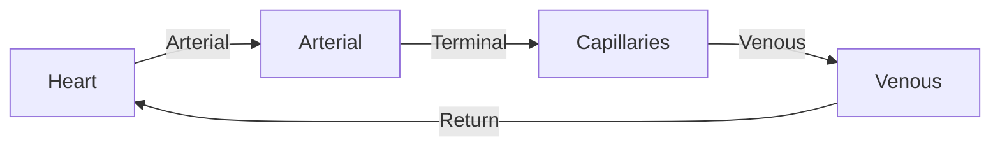
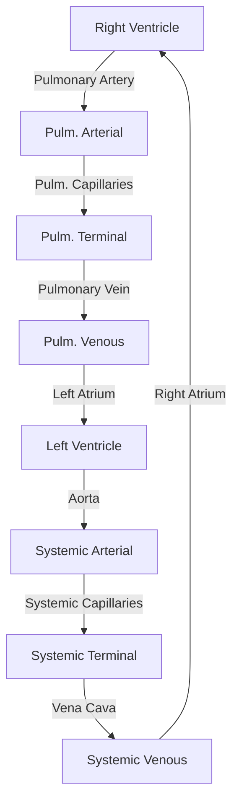
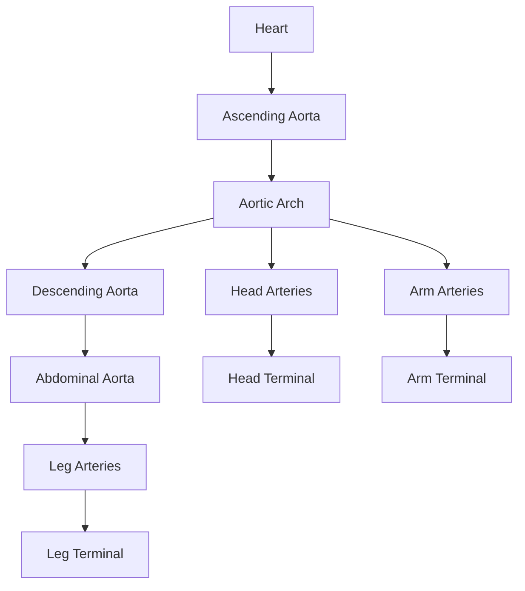
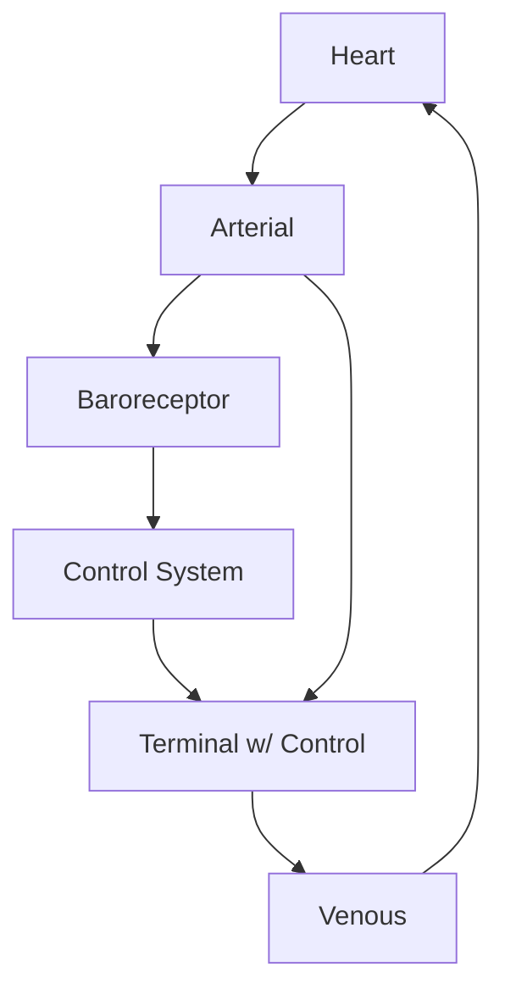

Vessel networks define the topology of cardiovascular models in Circulatory Autogen. They specify which components (vessels) exist, how they connect, and what type of physics each component uses.

## Vessel Array Files

The vessel array is a CSV file with five columns that defines the complete network topology:

```csv
name,BC_type,vessel_type,inp_vessels,out_vessels
heart,vp,heart,venous_ivc venous_svc,ascending_aorta
ascending_aorta,vv,arterial,heart,thoracic_aorta
thoracic_aorta,pv,arterial,ascending_aorta,abdominal_aorta
abdominal_aorta,pv,split_junction,thoracic_aorta,common_iliac_L common_iliac_R
common_iliac_L,pv,arterial,abdominal_aorta,leg_L_T
common_iliac_R,pv,arterial,abdominal_aorta,leg_R_T
leg_L_T,pp,terminal,common_iliac_L,venous_lb
leg_R_T,pp,terminal,common_iliac_R,venous_lb
venous_lb,vp,venous,leg_L_T leg_R_T,venous_ivc
venous_ivc,vp,venous,venous_lb,heart
```

### Column Definitions

<ResponseField name="name" type="string" required>
  **Unique identifier** for each vessel/component.
  
  Naming conventions:
  - Anatomical: `ascending_aorta`, `femoral_L`, `venous_svc`
  - Physiological: `systemic_T`, `pulmonary_arterial`, `head_R_T`
  - Functional: `heart`, `baroreceptor_aorta`, `volume_sum`
  
  Names must be unique and contain no spaces.
</ResponseField>

<ResponseField name="BC_type" type="string" required>
  **Boundary condition type** defining input/output causality.
  
  Common types:
  - `vv` - Volume flow in/out (internal vessels)
  - `vp` - Volume flow in, pressure out (pumps, venous return)
  - `pv` - Pressure in, volume flow out (arterial segments)
  - `pp` - Pressure in/out (terminal loads)
  - `nn` - No boundary conditions (control systems, constraints)
  
  Must match a `BC_type` in the module configuration JSON files.
</ResponseField>

<ResponseField name="vessel_type" type="string" required>
  **Module type** from the configuration JSON files.
  
  Available types (from built-in modules):
  - `arterial`, `arterial_simple` - Elastic arterial segments
  - `venous` - Venous segments with compliance
  - `terminal` - Capillary bed Windkessel models
  - `heart` - Cardiac chambers with time-varying elastance
  - `split_junction`, `merge_junction` - Vessel bifurcations/merges
  - `baroreceptor`, `chemoreceptor` - Sensors
  - `gas_transport_simple` - O2/CO2 transport
  
  Must match a `vessel_type` in `src/generators/resources/*_modules_config.json` or `module_config_user/*_config.json`.
</ResponseField>

<ResponseField name="inp_vessels" type="string">
  **Space-separated list** of input vessel names.
  
  Examples:
  - Single input: `heart`
  - Multiple inputs: `venous_ivc venous_svc`
  - No inputs: `` (empty, for source components)
  
  Each name must match a `name` from another row in the vessel array.
</ResponseField>

<ResponseField name="out_vessels" type="string">
  **Space-separated list** of output vessel names.
  
  Examples:
  - Single output: `ascending_aorta`
  - Multiple outputs: `aortic_arch_C46 brachiocephalic_trunk`
  - No outputs: `` (empty, for sink components or constraints)
  
  Special case: Some vessels (like `volume_sum`) connect to many vessels for conservation constraints.
</ResponseField>

## Vessel Types

Vessel types define the CellML module and physics for each component.

### Vascular Modules

<Tabs>
  <Tab title="Arterial Vessels">
    **Module:** `arterial` or `arterial_simple`
    
    **Physics:**
    - Resistance: Poiseuille flow
    - Compliance: Nonlinear pressure-volume relation
    - Inertance: Blood momentum (optional)
    
    **Parameters:**
    - `R_[name]` - Resistance (Js/m^6)
    - `C_[name]` or `E_[name]` - Compliance or elastance (m^6/J or J/m^3)
    - `I_[name]` - Inertance (Js^2/m^6)
    - `q_0_[name]` - Unstressed volume (m^3)
    - `l_[name]`, `r_0_[name]` - Length and radius for `arterial` type
    
    **BC types:** `vv`, `vp`, `pv`
  </Tab>
  
  <Tab title="Venous Vessels">
    **Module:** `venous`
    
    **Physics:**
    - Resistance: Linear viscous resistance
    - Compliance: Large compliance (low pressure, high volume)
    - External pressure: `u_ext` (e.g., intra-thoracic pressure)
    
    **Parameters:**
    - `R_[name]` - Resistance
    - `C_[name]` - Compliance (large value)
    - `u_ext_[name]` - External pressure
    - `q_0_[name]` - Unstressed volume
    
    **BC types:** `vp`, `pv`
  </Tab>
  
  <Tab title="Terminal Vessels">
    **Module:** `terminal`
    
    **Physics:** Windkessel model (resistance + compliance)
    - Resistance: Arteriolar resistance
    - Compliance: Capillary compliance
    
    **Parameters:**
    - `R_[name]` - Terminal resistance
    - `C_[name]` - Terminal compliance
    - `q_0_[name]` - Unstressed volume
    
    **BC types:** `pp`, `pp_wCont` (with control), `pp_wLocal` (with local autoregulation)
  </Tab>
  
  <Tab title="Junctions">
    **Module:** `split_junction`, `merge_junction`, `2in2out_junction`
    
    **Physics:** Algebraic constraints (mass conservation, pressure distribution)
    
    **Parameters:** Usually none (conservation laws)
    
    **BC types:** `pv` (split), `vp` (merge)
  </Tab>
</Tabs>

### Cardiac Modules

<Tabs>
  <Tab title="Heart">
    **Module:** `heart`
    
    **Physics:**
    - Time-varying elastance: `E(t) = E_min + (E_max - E_min) * e(t)`
    - Valves: Diodes allowing one-way flow
    - Activation: `e(t)` from `activation_function` module
    
    **Parameters:**
    - `E_min_[name]`, `E_max_[name]` - Min/max elastance
    - `V_dead_[name]` - Dead volume
    - `R_valve_[name]` - Valve resistance
    - Heart rate, activation timing parameters
    
    **BC types:** `vp`, `vp_Ca` (with calcium dynamics)
  </Tab>
  
  <Tab title="Activation Function">
    **Module:** `activation_function`
    
    **Physics:** Time-varying function `e(t)` for elastance
    - Systole: Rising phase
    - Diastole: Falling phase
    - Repeats with heart period
    
    **Parameters:**
    - Timing parameters (systole duration, heart period)
    - Shape parameters
    
    **BC types:** `nn` (provides signal via general ports)
  </Tab>
</Tabs>

### Control & Sensing Modules

<Tabs>
  <Tab title="Baroreceptors">
    **Module:** `baroreceptor`
    
    **Physics:**
    - Senses pressure changes
    - Outputs firing rate as function of pressure
    - May include adaptation dynamics
    
    **Ports:** Couples to vessel pressure via general port
    
    **BC types:** `nn`
  </Tab>
  
  <Tab title="Chemoreceptors">
    **Module:** `chemoreceptor`
    
    **Physics:**
    - Senses O2, CO2, pH
    - Outputs firing rate as function of chemical concentrations
    
    **Ports:** Couples to gas transport modules
    
    **BC types:** `nn`
  </Tab>
  
  <Tab title="Control Systems">
    **Module:** `control_system`, `pid_control`
    
    **Physics:**
    - Neural or hormonal control
    - Modulates resistance, heart rate, contractility
    
    **Ports:** Couples to sensors and effectors
    
    **BC types:** `nn`
  </Tab>
</Tabs>

## Connection Syntax

Vessels connect through the `inp_vessels` and `out_vessels` columns.

### Simple Linear Chain

```csv
name,BC_type,vessel_type,inp_vessels,out_vessels
A,vv,arterial,B,
B,pv,arterial,C,A
C,pv,arterial,,B
```

Flow: `C → B → A`

<Note>
The `inp_vessels` of vessel A lists the vessel(s) upstream. The `out_vessels` of vessel A lists the vessel(s) downstream.
</Note>

### Bifurcation (Split Junction)

```csv
name,BC_type,vessel_type,inp_vessels,out_vessels
parent,pv,arterial,upstream,junction
junction,pv,split_junction,parent,daughter1 daughter2
daughter1,pv,arterial,junction,terminal1
daughter2,pv,arterial,junction,terminal2
```

Flow: `parent` splits into `daughter1` and `daughter2` at `junction`

### Merge Junction

```csv
name,BC_type,vessel_type,inp_vessels,out_vessels
terminal1,pp,terminal,artery1,vein1
terminal2,pp,terminal,artery2,vein2
vein1,vp,venous,terminal1,merge
vein2,vp,venous,terminal2,merge
merge,vp,merge_junction,vein1 vein2,central_vein
central_vein,vp,venous,merge,heart
```

Flow: `vein1` and `vein2` merge at `merge`, continue to `central_vein`

### Multiple Inputs and Outputs

The heart in a 3-compartment model:

```csv
name,BC_type,vessel_type,inp_vessels,out_vessels
heart,vp_Ca,heart,venous_svc pvn,aortic_root par volume_sum
```

- **Inputs:** `venous_svc` (systemic return) and `pvn` (pulmonary return)
- **Outputs:** `aortic_root` (systemic output), `par` (pulmonary output), `volume_sum` (conservation constraint)

### Non-Spatial Connections (General Ports)

Baroreceptor sensing aortic pressure:

```csv
name,BC_type,vessel_type,inp_vessels,out_vessels
aortic_root,vv,arterial,heart,thoracic_aorta
baroreceptor_aorta,nn,baroreceptor,aortic_root,control_system
control_system,nn,control_system,baroreceptor_aorta,systemic_T
systemic_T,pp_wCont,terminal,abdominal_aorta,venous_return
```

- `baroreceptor_aorta` couples to `aortic_root` via a `general_port` for pressure
- `control_system` modulates resistance in `systemic_T` via another `general_port`

## Network Topology

Common cardiovascular network topologies:

### Simple Closed Loop (3-Compartment)



Vessel array:
```csv
name,BC_type,vessel_type,inp_vessels,out_vessels
heart,vp,heart,venous,arterial
arterial,vv,arterial_simple,heart,capillaries
capillaries,pp,terminal,arterial,venous
venous,vp,venous,capillaries,heart
```

### Systemic + Pulmonary Circulation



This requires two separate circulations with the heart pumping both.

### Arterial Tree with Bifurcations



From `resources/simple_physiological_vessel_array.csv`:
```csv
heart,vp,heart,venous_ivc venous_svc,ascending_aorta_A
ascending_aorta_A,vv,arterial,heart,ascending_aorta_B
ascending_aorta_B,pv,arterial,ascending_aorta_A,ascending_aorta_C
...
aortic_arch_C2,pv,split_junction,ascending_aorta_D,aortic_arch_C46 brachiocephalic_trunk_C4
brachiocephalic_trunk_C4,pv,split_junction,aortic_arch_C2,common_carotid_R6_A subclavian_R28
common_carotid_R6_A,pv,arterial,brachiocephalic_trunk_C4,head_R_T
subclavian_R28,pv,arterial,brachiocephalic_trunk_C4,arm_R_T
head_R_T,pp,terminal,common_carotid_R6_A,venous_ub
arm_R_T,pp,terminal,subclavian_R28,venous_ub
```

### Network with Control System



- Baroreceptor senses arterial pressure
- Control system adjusts terminal resistance based on baroreceptor input

## Real-World Examples

<AccordionGroup>
  <Accordion title="3-Compartment Model (3compartment_vessel_array.csv)">
    Simplest closed-loop model with systemic and pulmonary circulations:
    
    ```csv
    name,BC_type,vessel_type,inp_vessels,out_vessels
    pvn,vp,venous,par,heart volume_sum
    par,vp,arterial_simple,heart,pvn volume_sum
    heart,vp_Ca,heart,venous_svc pvn,aortic_root par volume_sum
    aortic_root,vv,arterial_simple,heart,systemic_T volume_sum
    systemic_T,pp,terminal,aortic_root,venous_svc volume_sum
    venous_svc,vp,venous,systemic_T,heart volume_sum
    volume_sum,nn,volume_sum,pvn par heart aortic_root systemic_T venous_svc,
    ```
    
    Features:
    - Heart pumps to both systemic (`aortic_root`, `systemic_T`, `venous_svc`) and pulmonary (`par`, `pvn`) loops
    - `volume_sum` constraint ensures conservation
  </Accordion>
  
  <Accordion title="Physiological Model (simple_physiological_vessel_array.csv)">
    Realistic human cardiovascular system with:
    - Heart with 4 chambers
    - Aortic arch with head and arm branches
    - Thoracic and abdominal aorta
    - Iliac and femoral arteries to legs
    - Upper and lower body venous return
    
    44 vessels total, includes:
    - 6 split junctions (bifurcations)
    - 6 terminal beds (head L/R, arm L/R, trunk, leg L/R)
    - Cascading BC types (`vv` at heart output → `pv` in arterial tree → `pp` at terminals → `vp` in veins)
  </Accordion>
  
  <Accordion title="Control System Model (control_phys_vessel_array.csv)">
    Adds baroreceptor and control system to physiological model:
    - Baroreceptor sensors in aorta and carotid arteries
    - Control system module receiving baroreceptor inputs
    - Terminal vessels with `pp_wCont` BC type respond to control signals
    - Adjusts peripheral resistance based on blood pressure
  </Accordion>
  
  <Accordion title="Gas Exchange Model (FTU_wCVS_vessel_array.csv)">
    Couples cardiovascular system with gas transport:
    - `gas_transport_simple` modules in arterial and venous vessels
    - O2 and CO2 concentrations tracked
    - Gas exchange at capillary beds
    - Oxygen consumption in tissues
    - CO2 production from metabolism
  </Accordion>
</AccordionGroup>

## Validation and Debugging

When creating vessel arrays:

<Steps>
  <Step title="Check name uniqueness">
    All vessel names must be unique. No duplicates allowed.
  </Step>
  
  <Step title="Verify connections">
    Every vessel in `inp_vessels` or `out_vessels` must exist as a `name` in the array.
    
    Use a script to check:
    ```python
    import pandas as pd
    df = pd.read_csv('vessel_array.csv')
    all_names = set(df['name'])
    for idx, row in df.iterrows():
        for inp in str(row['inp_vessels']).split():
            if inp not in all_names:
                print(f"Error: {inp} in inp_vessels of {row['name']} not found")
    ```
  </Step>
  
  <Step title="Match BC_type and vessel_type">
    The combination of `BC_type` and `vessel_type` must exist in a module config JSON.
    
    Check `src/generators/resources/*_modules_config.json` and `module_config_user/*_config.json`.
  </Step>
  
  <Step title="Check for closed loops">
    For a valid cardiovascular model, verify that:
    - All arterial paths lead to terminals
    - All terminals lead to venous return
    - All venous paths return to the heart
    - No dead ends (unless intentional)
  </Step>
  
  <Step title="Run autogeneration">
    The autogeneration script will catch many errors:
    ```bash
    cd user_run_files
    ./run_autogeneration.sh
    ```
    
    Common errors:
    - Missing parameters → creates `_parameters_unfinished.csv`
    - Port mismatch → error message about incompatible ports
    - Undefined vessel_type → error message about missing module config
  </Step>
</Steps>

## Best Practices

<AccordionGroup>
  <Accordion title="Use consistent naming">
    - Anatomical names for realistic models: `ascending_aorta`, `femoral_L`
    - L/R suffixes for left/right: `common_carotid_L`, `common_carotid_R`
    - Functional suffixes: `_T` for terminal, `_A`/`_B`/`_C` for segments
  </Accordion>
  
  <Accordion title="Organize vessel array logically">
    Group vessels by system:
    1. Heart and activation
    2. Systemic arterial tree
    3. Systemic terminals
    4. Systemic venous return
    5. Pulmonary circulation
    6. Control systems
    7. Constraints (volume_sum, etc.)
  </Accordion>
  
  <Accordion title="Use appropriate BC_type cascades">
    - Arterial tree: `vv` (at heart) → `pv` (arteries) → `pp` (terminals)
    - Venous return: `vp` throughout
    - Control systems: `nn`
  </Accordion>
  
  <Accordion title="Start small, then expand">
    1. Start with 3-compartment model
    2. Add pulmonary circulation
    3. Split systemic into upper/lower body
    4. Add more arterial segments
    5. Add control systems
    6. Add gas transport
  </Accordion>
  
  <Accordion title="Document your network">
    Add a comment header to your CSV or maintain a separate diagram showing the network topology.
  </Accordion>
</AccordionGroup>

## Next Steps

<CardGroup cols={2}>
  <Card title="Model Generation" icon="gears" href="/generation/running-autogeneration">
    Generate CellML models from vessel arrays
  </Card>
  
  <Card title="Parameter Definition" icon="sliders" href="/generation/parameters">
    Define parameters for your vessel network
  </Card>
</CardGroup>
