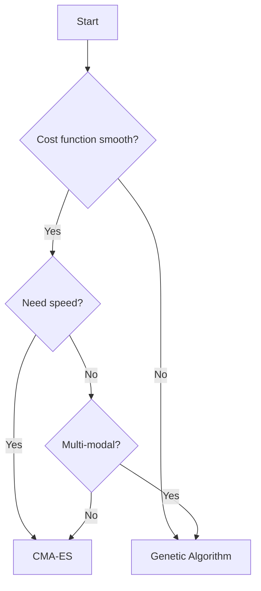

Circulatory Autogen provides multiple optimization algorithms for parameter identification. Choose based on your problem characteristics and computational resources.

## Algorithm Comparison

<CardGroup cols={3}>
  <Card title="Genetic Algorithm" icon="dna">
    **Status:** Default, well-tested
    
    **Best for:**
    - Multi-modal problems
    - Non-smooth cost functions
    - Robust global search
    
    **Requires:** Standard dependencies
  </Card>
  
  <Card title="CMA-ES" icon="chart-line-up">
    **Status:** Well-supported
    
    **Best for:**
    - Smooth landscapes
    - Faster convergence
    - Parallel execution
    
    **Requires:** `pip install nevergrad`
  </Card>
  
  <Card title="Bayesian" icon="brain">
    **Status:** Deprecated, untested
    
    **Best for:**
    - Expensive simulations
    - Sample efficiency
    
    **Requires:** `pip install scikit-optimize`
  </Card>
</CardGroup>

## Genetic Algorithm

### Overview

The genetic algorithm (GA) is a population-based evolutionary optimization method that mimics natural selection.

**Algorithm:** `genetic_algorithm`

**Reference:** `src/param_id/optimisers.py:GeneticAlgorithmOptimiser`

### How It Works

1. **Initialize** random population of parameter sets within bounds
2. **Evaluate** cost function for each individual
3. **Select** best performers (survivors)
4. **Mutate** survivors to create variations
5. **Crossbreed** pairs of survivors
6. **Repeat** until convergence or max iterations

### Configuration

```yaml
param_id_method: genetic_algorithm

optimiser_options:
  num_calls_to_function: 10000  # Total simulations
  cost_convergence: 0.001       # Stop if cost < this
  max_patience: 10              # Stop if no improvement for N generations
  cost_type: MSE                # MSE or AE
```

### Population Parameters

The GA uses different population sizes based on the `DEBUG` flag:

<Tabs>
  <Tab title="Production (DEBUG: false)">
    ```python
    num_elite = 12              # Top performers kept unchanged
    num_survivors = 48          # Total survivors per generation
    num_mutations_per_survivor = 12
    num_cross_breed = 120
    
    # Total population per generation
    num_pop = 48 + (48 × 12) + 120 = 744
    ```
  </Tab>
  
  <Tab title="Debug (DEBUG: true)">
    ```python
    num_elite = 4
    num_survivors = 6
    num_mutations_per_survivor = 2
    num_cross_breed = 10
    
    # Total population per generation
    num_pop = 6 + (6 × 2) + 10 = 28
    ```
  </Tab>
</Tabs>

### Genetic Operations

**Mutation:** Each survivor creates variants by:
- 50% chance: Multiply by (1 + 0.1 × random_normal)
- 50% chance: Add (0.1 × random_normal)

**Crossbreeding:** Random pairs create offspring:
- 50% chance: Average parents × (1 + 0.1 × random_normal)  
- 50% chance: Average parents + (0.1 × random_normal)

**Selection:** Survivors chosen by:
- Keep top `num_elite` unchanged
- Select remaining from population weighted by inverse cost

### Convergence Criteria

Optimization stops when:

1. **Cost convergence**: `best_cost < cost_convergence`
2. **Max patience**: No improvement for `max_patience` generations
3. **Max iterations**: Reached `num_calls_to_function / num_pop` generations

### Pros and Cons

<AccordionGroup>
  <Accordion title="Advantages">
    - **Robust**: Works well with non-smooth, multi-modal cost functions
    - **Well-tested**: Default method, extensively validated
    - **No additional dependencies**: Works out of the box
    - **Handles constraints**: Naturally respects parameter bounds
    - **Parallel execution**: Distributes population across MPI processes
  </Accordion>
  
  <Accordion title="Disadvantages">
    - **Many evaluations**: Requires large population sizes (744 per generation)
    - **Slower convergence**: Not as efficient as gradient-based methods
    - **Parameter tuning**: Population sizes affect performance
    - **Random elements**: Results may vary between runs
  </Accordion>
</AccordionGroup>

### Example Configuration

```yaml
file_prefix: 3compartment
param_id_method: genetic_algorithm

optimiser_options:
  num_calls_to_function: 50000  # ~67 generations with pop=744
  cost_convergence: 0.0001
  max_patience: 15
  cost_type: MSE

DEBUG: false
```

## CMA-ES

### Overview

Covariance Matrix Adaptation Evolution Strategy (CMA-ES) is an efficient gradient-free optimizer that adapts its search distribution.

**Algorithm:** `CMA-ES`

**Implementation:** Nevergrad library

**Reference:** `src/param_id/optimisers.py:CMAESOptimiser`

### How It Works

1. **Initialize** from parameters CSV (within bounds)
2. **Sample** candidate solutions from multivariate normal distribution
3. **Evaluate** cost for each candidate
4. **Adapt** covariance matrix based on successful steps
5. **Update** mean and step size (sigma)
6. **Repeat** until convergence

CMA-ES learns the correlation structure between parameters, making it efficient for ill-conditioned problems.

### Configuration

```yaml
param_id_method: CMA-ES

optimiser_options:
  num_calls_to_function: 10000  # Budget for function evaluations
  cost_convergence: 0.001       # Convergence tolerance
  max_patience: 10              # Patience for no improvement
  cost_type: MSE
  
  # CMA-ES specific:
  sigma0: 0.1  # Optional: initial standard deviation
```

### CMA-ES Specific Options

<ParamField path="sigma0" type="float" default="0.2 × mean(param_range)">
  Initial standard deviation controlling step size.
  
  - **Default**: 20% of mean parameter range
  - **Smaller** (e.g., 0.05): Conservative, fine-tuning
  - **Larger** (e.g., 0.3): Aggressive exploration
  - **Adaptive**: CMA-ES will adjust this during optimization
</ParamField>

### Initial Values

CMA-ES loads starting values from `[file_prefix]_parameters.csv`:

```python
x0 = [param_csv_value_1, param_csv_value_2, ...]
```

If initial values are outside bounds, they're automatically set to the midpoint:
```python
x0[i] = 0.5 × (min[i] + max[i])
```

<Warning>
**Out of Bounds Warning:** If parameters from CSV are outside your `params_for_id.csv` bounds, you'll see:

```
WARNING: Initial parameter values from CSV are outside bounds!
  Parameter: C_ao
    Value from CSV: 1.2e-7
    Bounds: [1.0e-9, 5.0e-8]
    Setting to mean: 2.5005e-8
```

Adjust either the CSV values or the bounds in `params_for_id.csv`.
</Warning>

### Parallel Execution

CMA-ES automatically uses all MPI processes:

```bash
./run_param_id.sh 16  # Uses 16 parallel workers
```

Number of workers = number of MPI processes. Each iteration evaluates `num_workers` candidates in parallel.

### Convergence Criteria

Optimization stops when:

1. **Cost convergence**: `best_cost < cost_convergence`
2. **Max patience**: No improvement for `max_patience` iterations
3. **Budget exhausted**: Reached `num_calls_to_function` evaluations

### Pros and Cons

<AccordionGroup>
  <Accordion title="Advantages">
    - **Efficient**: Often converges faster than GA
    - **Adaptive**: Learns parameter correlations automatically
    - **Parallel**: Natural support for distributed evaluation
    - **Smooth landscapes**: Excellent for continuous, smooth problems
    - **Ill-conditioned**: Handles parameters with different scales well
  </Accordion>
  
  <Accordion title="Disadvantages">
    - **External dependency**: Requires Nevergrad (`pip install nevergrad`)
    - **Smooth assumption**: Less robust than GA for highly non-smooth functions
    - **Local minima**: May get stuck more easily than GA
    - **Initial point sensitive**: Performance depends on starting location
  </Accordion>
</AccordionGroup>

### Example Configuration

```yaml
file_prefix: 3compartment
param_id_method: CMA-ES

optimiser_options:
  num_calls_to_function: 5000   # CMA-ES often needs fewer evaluations
  cost_convergence: 0.0001
  max_patience: 20
  cost_type: MSE
  sigma0: 0.15  # Moderate initial exploration
```

### Installation

```bash
pip install nevergrad
```

## Bayesian Optimization

<Warning>
Bayesian optimization is **deprecated and untested**. Use Genetic Algorithm or CMA-ES instead.
</Warning>

### Overview

Bayesian optimization uses Gaussian processes to model the cost function and selects evaluation points that balance exploration and exploitation.

**Algorithm:** `bayesian`

**Implementation:** scikit-optimize (skopt)

**Reference:** `src/param_id/optimisers.py:BayesianOptimiser`

### Configuration

```yaml
param_id_method: bayesian

optimiser_options:
  num_calls_to_function: 1000
  cost_convergence: 0.001
  max_patience: 10
```

### How It Works

1. **Initialize** with random samples
2. **Build** Gaussian process model of cost function
3. **Acquire** next evaluation point using acquisition function (EI, PI, LCB)
4. **Update** GP model with new observation
5. **Repeat** until budget exhausted

### Why Deprecated?

- **Untested**: Not validated on recent Circulatory Autogen versions
- **Scalability**: GP inference becomes expensive with many parameters
- **Better alternatives**: GA and CMA-ES are more reliable and tested

### Installation

```bash
pip install scikit-optimize
```

## Choosing an Optimizer

### Decision Guide



### Recommendations

<AccordionGroup>
  <Accordion title="Use Genetic Algorithm when:">
    - Cost function has discontinuities or noise
    - Problem is highly multi-modal (many local minima)
    - You want maximum robustness
    - This is your first attempt at parameter ID
    - Computational time is not critical
  </Accordion>
  
  <Accordion title="Use CMA-ES when:">
    - Cost function is relatively smooth
    - You want faster convergence
    - Parameters have different scales/units
    - You have good initial parameter estimates
    - You can install Nevergrad
  </Accordion>
  
  <Accordion title="Avoid Bayesian when:">
    - Any production use (deprecated)
    - More than ~10 parameters
    - Cost evaluations are cheap
  </Accordion>
</AccordionGroup>

### Performance Comparison

| Metric | Genetic Algorithm | CMA-ES | Bayesian |
|--------|------------------|--------|----------|
| **Speed** | Slow | Fast | Medium |
| **Robustness** | High | Medium | Low (deprecated) |
| **Parallelization** | Excellent | Excellent | Good |
| **Function evals** | 10,000+ | 5,000+ | 1,000+ |
| **Setup complexity** | Easy | Medium | Medium |
| **Dependencies** | None | Nevergrad | scikit-optimize |

## Advanced Configuration

### Multi-Optimizer Strategy

For difficult problems, use a two-stage approach:

**Stage 1: Genetic Algorithm (broad search)**
```yaml
param_id_method: genetic_algorithm
optimiser_options:
  num_calls_to_function: 20000
  cost_convergence: 0.01  # Loose tolerance
```

**Stage 2: CMA-ES (refinement)**
```yaml
param_id_method: CMA-ES
# Use GA results as initial values in parameters CSV
optimiser_options:
  num_calls_to_function: 5000
  cost_convergence: 0.0001  # Tight tolerance
  sigma0: 0.05  # Small for local refinement
```

### Monitoring Progress

Track optimization in real-time:

```bash
# Watch cost history
tail -f param_id_output/*/best_cost_history.csv

# Check current best
cat param_id_output/*/best_cost.npy
```

### Output Files

All optimizers save:

```
param_id_output/[method]_[model]_[obs]/
├── best_param_vals.npy          # Best parameters found
├── best_cost.npy                # Best cost achieved
├── best_cost_history.csv        # Cost over iterations
├── best_param_vals_history.csv  # Parameter evolution
└── plots_param_id/              # Comparison plots
```

## Implementation Details

### Base Class

All optimizers inherit from `Optimiser` base class:

```python
class Optimiser(ABC):
    def __init__(self, param_id_obj, param_id_info, param_norm_obj,
                 num_params, output_dir, optimiser_options, DEBUG):
        # Common initialization
        self.best_param_vals = None
        self.best_cost = np.inf
        
    @abstractmethod
    def run(self):
        # Optimizer-specific implementation
        pass
```

### Method Signatures

**Genetic Algorithm:**
```python
class GeneticAlgorithmOptimiser(Optimiser):
    def run(self):
        # Population-based evolution
        # Returns best_param_vals, best_cost
```

**CMA-ES:**
```python
class CMAESOptimiser(Optimiser):
    def __init__(self, ..., optimiser_options):
        self.sigma0 = optimiser_options.get('sigma0', default)
        
    def run(self):
        # CMA-ES with Nevergrad
        # Returns best_param_vals, best_cost
```

## Next Steps

<CardGroup cols={2}>
  <Card title="Configuration" icon="gear" href="/param-id/configuration">
    Set up optimiser_options in detail
  </Card>
  <Card title="Observation Data" icon="chart-line" href="/param-id/observation-data">
    Define the cost function and observables
  </Card>
  <Card title="MCMC" icon="chart-scatter" href="/param-id/mcmc">
    Uncertainty quantification after optimization
  </Card>
</CardGroup>
